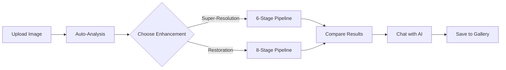
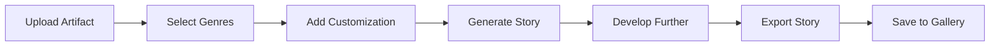

# 🏛️ Heri-Sci: AI-Powered Historical Artifact Analysis & Sci-Fi Story Generator

<div align="center">


[](https://nextjs.org/)
[](https://www.python.org/)
[](https://firebase.google.com/)
[](https://deepmind.google/technologies/gemini/)

**Transform historical artifacts into enhanced images and futuristic narratives with the power of AI**

[Features](#-features) • [Demo](#-demo) • [Installation](#-installation) • [Usage](#-usage) • [Tech Stack](#-tech-stack) • [Contributing](#-contributing)

</div>

---

## 🌟 What is Heri-Sci?

Heri-Sci is a cutting-edge web application that bridges the past and future through AI technology. It combines advanced image processing, historical analysis, and creative storytelling to offer three powerful modes:

### 🔬 **AI Lab** - Artifact Enhancement & Analysis
Upload historical artifact images and watch as AI enhances them with professional-grade super-resolution and restoration algorithms. Get instant Wikipedia-powered insights and chat with Gemini AI about historical context, civilizations, and cultural significance.

### 🚀 **Sci-Fi Writer** - Artifact-to-Story Generator
Transform ancient artifacts into futuristic narratives! Select from 25+ sci-fi genres (Cyberpunk, Space Opera, Time Travel, Biopunk, and more), customize your preferences, and let AI generate creative stories that blend historical fact with speculative fiction.

### 🖼️ **Gallery** - Session Management
Save, organize, and continue your work. All your enhanced images, AI conversations, and generated stories are stored in one beautiful gallery with search, filter, and session continuation features.

---

## ✨ Features

### 🎨 **AI Lab - Image Processing**
- **6-Stage Super-Resolution Pipeline** - Professional-grade image enhancement
- **8-Stage Adaptive Restoration** - Repair damaged or degraded artifacts
- **Real-time Image Comparison** - Side-by-side slider to see enhancements
- **Automatic Analysis** - Instant artifact detection and Wikipedia integration
- **Context-Aware AI Chat** - Ask questions, get intelligent responses
- **Local Image Storage** - Compressed data URLs for fast, CORS-free storage

### 📚 **Sci-Fi Writer - Story Generation**
- **25+ Genre Selection** - Choose multiple genres to blend
  - Science Fiction, Cyberpunk, Space Opera, Dystopian
  - Time Travel, Alien Contact, Post-Apocalyptic, Steampunk
  - Hard Sci-Fi, Soft Sci-Fi, Military Sci-Fi, Biopunk
  - Nanopunk, Solarpunk, Dieselpunk, Atompunk
  - Retrofuturism, Climate Fiction, Generation Ship
  - First Contact, Parallel Universe, Virtual Reality
  - AI & Robots, Genetic Engineering, Space Colonization
- **Custom Preferences** - Add themes, characters, or settings
- **Genre Blending** - AI seamlessly combines multiple genres
- **Interactive Story Development** - Continue conversations to expand your story
- **Export Stories** - Download your narratives as text files

### 🗂️ **Gallery - Session Management**
- **Unified Gallery** - Both AI Lab and Sci-Fi sessions in one place
- **Session Continuation** - Pick up exactly where you left off
- **Search & Filter** - Find sessions by type, tags, or keywords
- **Auto-Save** - Sessions automatically saved every 3 messages
- **Download Enhanced Images** - Export your processed artifacts
- **Chat History** - Review all conversations and AI responses

### 🤖 **AI Intelligence**
- **Gemini 2.0 Flash** - Google's latest multimodal AI
- **Context-Aware Responses** - Short answers for simple questions, detailed for complex ones
- **Image Analysis** - Direct visual understanding of artifacts
- **Wikipedia Integration** - Automatic historical context
- **No Hardcoded Responses** - All answers are dynamic and relevant

---

## 🎬 Demo

### AI Lab in Action
```
1. Upload artifact image → 📸 Image received!
2. Auto-analysis → 🔍 Detected: Ancient Chinese Cuneiform
3. Enhance → Super-Resolution or Restoration
4. Chat → "What language is this?" → "Mesopotamian cuneiform"
5. Save → Gallery for later access
```

### Sci-Fi Writer Flow
```
1. Upload artifact → Historical pottery
2. Select genres → Cyberpunk + Time Travel + AI & Robots
3. Customize → "Include a hacker protagonist in neon-lit cities"
4. Generate → AI creates genre-blended story concept
5. Develop → Continue conversation to expand plot, characters, world
6. Export → Download your complete story
```

---

## 🚀 Installation

### Prerequisites

- **Node.js** 16+ and npm/yarn
- **Python** 3.8+
- **Firebase Account** (for Firestore database)
- **Google Gemini API Key** (for AI features)

### Quick Start

#### 1️⃣ Clone the Repository
```bash
git clone https://github.com/im-sid/heri.git
cd heri
```

#### 2️⃣ Backend Setup

```bash
# Navigate to backend
cd backend

# Create virtual environment
python -m venv venv

# Activate virtual environment
# Windows:
venv\Scripts\activate
# macOS/Linux:
source venv/bin/activate

# Install dependencies
pip install -r requirements.txt

# Create .env file
cp .env.example .env
```

**Edit `backend/.env`:**
```env
GEMINI_API_KEY=your_gemini_api_key_here
OPENAI_API_KEY=your_openai_key_optional
FLASK_ENV=development
```

**Get your Gemini API Key:**
1. Visit [Google AI Studio](https://makersuite.google.com/app/apikey)
2. Create a new API key
3. Copy and paste into `.env`

#### 3️⃣ Frontend Setup

```bash
# Navigate to frontend (from project root)
cd frontend

# Install dependencies
npm install
# or
yarn install

# Create .env.local file
cp .env.local.example .env.local
```

**Edit `frontend/.env.local`:**
```env
NEXT_PUBLIC_FIREBASE_API_KEY=your_firebase_api_key
NEXT_PUBLIC_FIREBASE_AUTH_DOMAIN=your_project.firebaseapp.com
NEXT_PUBLIC_FIREBASE_PROJECT_ID=your_project_id
NEXT_PUBLIC_FIREBASE_STORAGE_BUCKET=your_project.appspot.com
NEXT_PUBLIC_FIREBASE_MESSAGING_SENDER_ID=your_sender_id
NEXT_PUBLIC_FIREBASE_APP_ID=your_app_id
```

#### 4️⃣ Firebase Setup

1. **Create Firebase Project**
   - Go to [Firebase Console](https://console.firebase.google.com/)
   - Create a new project
   - Enable Firestore Database

2. **Get Firebase Config**
   - Project Settings → General → Your apps
   - Copy the config values to `frontend/.env.local`

3. **Deploy Firestore Indexes**
   ```bash
   # From project root
   npm install -g firebase-tools
   firebase login
   firebase init firestore
   firebase deploy --only firestore:indexes
   ```

4. **Set Firestore Rules** (for development)
   ```javascript
   rules_version = '2';
   service cloud.firestore {
     match /databases/{database}/documents {
       match /{document=**} {
         allow read, write: if request.auth != null;
       }
     }
   }
   ```

#### 5️⃣ Run the Application

**Terminal 1 - Backend:**
```bash
cd backend
python app.py
# Server runs on http://localhost:5000
```

**Terminal 2 - Frontend:**
```bash
cd frontend
npm run dev
# or
yarn dev
# App runs on http://localhost:3000
```

#### 6️⃣ Open Your Browser
Navigate to **http://localhost:3000** and start exploring! 🎉

---

## 📖 Usage Guide

### Getting Started

1. **Sign Up / Login**
   - Create an account or sign in with existing credentials
   - All your sessions are saved to your account

2. **Choose Your Mode**
   - **AI Lab** - For image enhancement and historical analysis
   - **Sci-Fi Writer** - For creative story generation
   - **Gallery** - To view and continue saved sessions

### AI Lab Workflow



**Tips:**
- Upload clear, high-resolution images for best results
- Use Super-Resolution for small/pixelated images
- Use Restoration for damaged/degraded artifacts
- Ask specific questions for concise answers
- Request detailed analysis when needed

### Sci-Fi Writer Workflow



**Tips:**
- Select 2-3 genres for interesting blends
- Be specific in customization for better results
- Continue the conversation to expand your story
- Save frequently to preserve your work
- Export stories before closing the session

### Gallery Features

- **Filter by Type**: AI Lab or Sci-Fi sessions
- **Search**: Find sessions by title, tags, or content
- **Continue**: Resume any session with full context
- **Delete**: Remove unwanted sessions
- **Download**: Export enhanced images or stories

---

## 🛠️ Tech Stack

### Frontend
- **Next.js 14** - React framework with App Router
- **TypeScript** - Type-safe development
- **Tailwind CSS** - Utility-first styling
- **Firebase SDK** - Authentication & Firestore
- **Lucide Icons** - Beautiful icon library
- **React Hot Toast** - Elegant notifications

### Backend
- **Flask** - Python web framework
- **Google Gemini 2.0 Flash** - Multimodal AI
- **PIL/Pillow** - Image processing
- **OpenCV** - Advanced image algorithms
- **NumPy** - Numerical computations
- **Requests** - HTTP library for Wikipedia API

### Database & Storage
- **Firebase Firestore** - NoSQL cloud database
- **Local Storage** - Compressed image data URLs
- **Session Management** - Real-time sync

### AI & ML
- **Gemini 2.0 Flash** - Image analysis & chat
- **Custom Algorithms** - 6-stage super-resolution
- **Adaptive Restoration** - 8-stage pipeline
- **Wikipedia API** - Historical context

---

## 📁 Project Structure

```
heri/
├── frontend/                 # Next.js frontend
│   ├── src/
│   │   ├── app/             # App router pages
│   │   │   ├── chatbot/     # AI Lab page
│   │   │   ├── scifi-writer/# Sci-Fi Writer page
│   │   │   ├── gallery/     # Gallery page
│   │   │   └── gemini-chat/ # Direct Gemini chat
│   │   ├── components/      # React components
│   │   │   ├── chatbot/     # AI Lab components
│   │   │   ├── scifi/       # Sci-Fi Writer components
│   │   │   ├── gallery/     # Gallery components
│   │   │   └── layout/      # Layout components
│   │   ├── lib/             # Utilities & Firebase
│   │   ├── hooks/           # Custom React hooks
│   │   └── styles/          # Global styles
│   └── public/              # Static assets
│
├── backend/                 # Flask backend
│   ├── models/              # AI models & algorithms
│   │   ├── gemini_chat.py   # Gemini integration
│   │   ├── auto_image_analyzer.py
│   │   └── advanced_artifact_detector.py
│   ├── uploads/             # Temporary uploads
│   ├── processed/           # Processed images
│   └── app.py               # Main Flask app
│
├── firestore.indexes.json   # Firestore indexes
├── FIREBASE_SETUP.md        # Firebase setup guide
├── QUICK_SETUP.md           # Quick start guide
└── README.md                # This file
```

---

## 🔧 Configuration

### Environment Variables

**Backend (`backend/.env`):**
```env
GEMINI_API_KEY=your_gemini_api_key
OPENAI_API_KEY=your_openai_key_optional
FLASK_ENV=development
FLASK_DEBUG=True
```

**Frontend (`frontend/.env.local`):**
```env
NEXT_PUBLIC_FIREBASE_API_KEY=your_key
NEXT_PUBLIC_FIREBASE_AUTH_DOMAIN=your_domain
NEXT_PUBLIC_FIREBASE_PROJECT_ID=your_project_id
NEXT_PUBLIC_FIREBASE_STORAGE_BUCKET=your_bucket
NEXT_PUBLIC_FIREBASE_MESSAGING_SENDER_ID=your_sender_id
NEXT_PUBLIC_FIREBASE_APP_ID=your_app_id
```

### Image Compression Settings

Located in `frontend/src/lib/imageUtils.ts`:
```typescript
// Default: 1200x900 at 85% quality
compressImage(file, 1200, 900, 0.85)
```

Adjust these values based on your needs:
- **Higher resolution** = Better quality, larger files
- **Lower resolution** = Faster loading, smaller files
- **Quality 0.7-0.9** = Good balance

---

## 🎯 API Endpoints

### Backend API

| Endpoint | Method | Description |
|----------|--------|-------------|
| `/api/health` | GET | Health check |
| `/api/auto-analyze` | POST | Analyze uploaded image |
| `/api/process-image` | POST | Super-resolution/restoration |
| `/api/gemini-chat` | POST | Chat with Gemini AI |
| `/api/scifi-story-generate` | POST | Generate sci-fi story |
| `/api/scifi-chat` | POST | Continue story development |

### Request Examples

**Auto-Analyze:**
```javascript
POST /api/auto-analyze
{
  "image": "data:image/jpeg;base64,..."
}
```

**Generate Story:**
```javascript
POST /api/scifi-story-generate
{
  "imageUrl": "data:image/jpeg;base64,...",
  "genres": ["cyberpunk", "time-travel"],
  "customization": "Include a hacker protagonist",
  "prompt": "Generate a creative story..."
}
```

---

## 🤝 Contributing

We welcome contributions! Here's how you can help:

### Ways to Contribute

1. **🐛 Report Bugs** - Open an issue with details
2. **💡 Suggest Features** - Share your ideas
3. **📝 Improve Documentation** - Help others understand
4. **🔧 Submit Pull Requests** - Fix bugs or add features

### Development Workflow

```bash
# Fork the repository
# Clone your fork
git clone https://github.com/YOUR_USERNAME/heri.git

# Create a feature branch
git checkout -b feature/amazing-feature

# Make your changes
# Test thoroughly

# Commit with clear messages
git commit -m "feat: Add amazing feature"

# Push to your fork
git push origin feature/amazing-feature

# Open a Pull Request
```

### Code Style

- **Frontend**: Follow Next.js and React best practices
- **Backend**: Follow PEP 8 Python style guide
- **Commits**: Use conventional commits (feat, fix, docs, etc.)
- **Testing**: Test your changes before submitting

---

## 📝 License

This project is licensed under the MIT License - see the [LICENSE](LICENSE) file for details.

---

## 🙏 Acknowledgments

- **Google Gemini** - For powerful multimodal AI
- **Firebase** - For reliable backend services
- **Next.js Team** - For an amazing React framework
- **Open Source Community** - For inspiration and tools

---

## 📧 Contact & Support

- **GitHub Issues**: [Report bugs or request features](https://github.com/im-sid/heri/issues)
- **Discussions**: [Join the conversation](https://github.com/im-sid/heri/discussions)
- **Email**: [Your contact email]

---

## 🌟 Star History

If you find this project useful, please consider giving it a star! ⭐

[](https://star-history.com/#im-sid/heri&Date)

---

<div align="center">

**Made with ❤️ by the Heri-Sci Team**

[⬆ Back to Top](#-heri-sci-ai-powered-historical-artifact-analysis--sci-fi-story-generator)

</div>
